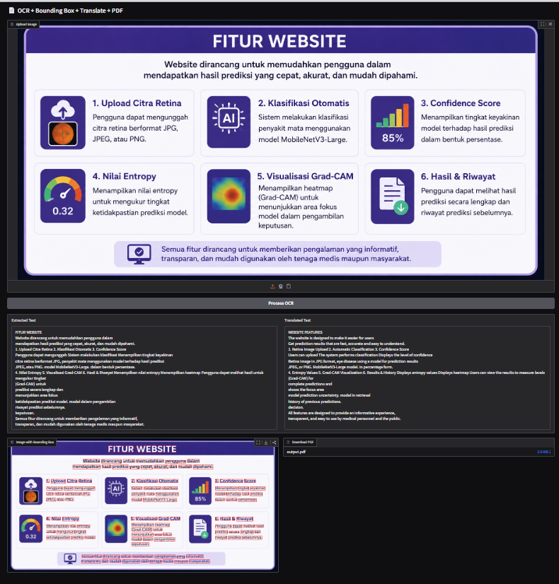

# 📄 Smart OCR Translator

A Computer Vision-based OCR application that extracts text from images using **Optical Character Recognition (OCR)**, detects text regions with bounding boxes, translates extracted content automatically, and exports the results into a PDF document.

This project uses **Tesseract OCR** for text recognition, **Google Translator** for language translation, and **Gradio** to create an interactive web-based interface. Users can upload images containing text, view extracted results, visualize detected text locations, translate the content, and download the processed output as a PDF file.

---

## ✨ Features

### 🔍 OCR Text Extraction
- Extract text from images using **Tesseract OCR**.
- Supports recognition of text from image-based documents.

### 📦 Text Detection Visualization
- Detects text locations and displays bounding boxes around recognized words.
- Provides visual feedback of OCR detection areas.

### 🌐 Automatic Translation
- Translates extracted text automatically between **English and Indonesian**.
- Helps users understand text from different languages.

### 📑 PDF Export
- Converts extracted OCR results into a downloadable PDF document.
- Allows users to save processed text for further use.

### 🖥️ Interactive Web Interface
- Built with **Gradio** for a simple and user-friendly experience.
- Supports image upload and real-time result visualization.

---

## 🛠️ Technologies Used

| Technology | Description |
|------------|-------------|
| Python | Main programming language |
| Gradio | Web interface framework |
| Tesseract OCR | Text recognition engine |
| PyTesseract | Python wrapper for Tesseract OCR |
| Pillow (PIL) | Image processing |
| NumPy | Numerical computation |
| Deep Translator | Text translation |
| ReportLab | PDF generation |

---

## 🔄 Workflow

1. Upload an image containing text.
2. Process the image using Tesseract OCR.
3. Extract text and identify text positions.
4. Draw bounding boxes on detected text areas.
5. Translate extracted text automatically.
6. Export OCR results into PDF format.

---

## 📷 Prediction Result

<p align="center">
  
</p>

---

## 🚀 How to Run

### 1. Clone Repository

```bash
git clone https://github.com/ys124xkd/smart-ocr-translator.git
cd smart-ocr-translator
